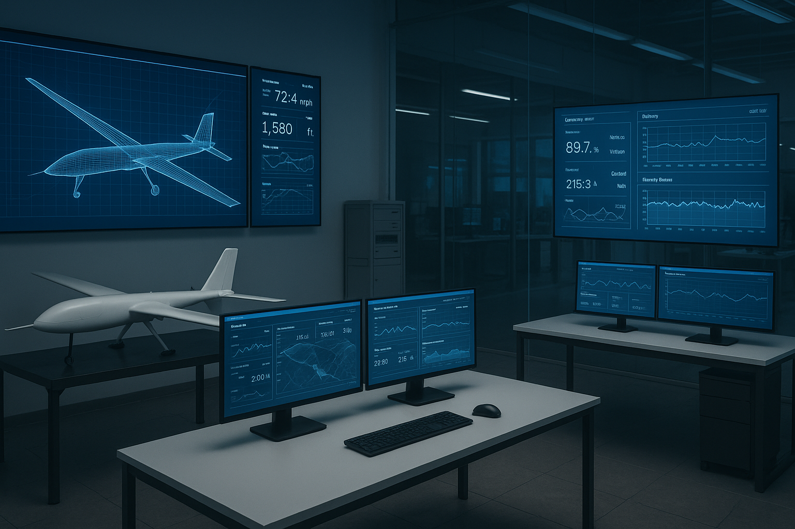

  

# **UAV Flight Simulation Prototype**

*A modular testbed for timeline-based UAV mission simulation, endurance analysis, and mission playback*

**Built by Tareq Omrani**  
AI Engineering + UAV Systems | 2025

---

## Overview

This project simulates UAV endurance, power consumption, and mission behavior **step-by-step over time**.

It extends the original *UAV Battery Efficiency Estimator* into a **mission-oriented simulation environment**, supporting:

- Battery and ICE-powered UAVs  
- Atmospheric and aerodynamic effects  
- Thermal and detectability modeling  
- Waypoint-based mission playback  
- Multi-UAV (swarm) mission reasoning  

The goal is not full flight dynamics, but **mission-relevant realism** suitable for planning, education, and research-grade demonstrations.

---

## Features

### Core simulation
- Time-stepped **battery and fuel depletion simulation**
- Dispatchable endurance with reserve modeling
- ISA-based air density and altitude effects
- Fixed-wing aerodynamic power modeling (drag polar)
- Rotorcraft density scaling and gust penalties
- Terrain and stealth drag modifiers

### Mission workflow
- Waypoint-based mission paths
- Timeline playback with position updates
- Mission distance and heading-range estimation
- Live battery and fuel gauges with timers
- Mobile-friendly Streamlit UI

### Thermal & detectability modeling
- Convective + radiative thermal ΔT estimation
- **AI visual detectability score (0–100)**
- **IR thermal detectability score (0–100)**
- Overall detectability risk classification

### Advanced logic
- ICE fuel burn using BSFC (MQ-class style)
- Experimental hybrid assist mode
- Multi-agent swarm advisor (LLM-backed with heuristic fallback)
- Threat-zone awareness and stealth ingress behavior

### Exports
- Scenario summary (CSV / JSON)
- Individual UAV detailed results (CSV / JSON)
- Swarm mission playback logs (CSV)
- Mission waypoints (CSV)

---

## Why It Matters

This tool helps:

- **Predict mission feasibility and endurance limits**
- Explore **energy–stealth–performance tradeoffs**
- Demonstrate AI-assisted mission reasoning
- Prototype autonomous and swarm behaviors safely
- Communicate UAV system concepts visually and interactively

It is designed for **mission planning insight**, not joystick-level flight control.

---

## Roadmap (Current Status)

- [x] **Time-based simulation core**
- [x] **Battery and fuel depletion logic**
- [x] **Terrain-aware simulation**
- [x] **Exportable logs and reports**
- [x] **Map-based mission playback (waypoints + timeline)**
- [~] **Abort logic**  
  Depletion-based stop and swarm RTB behaviors exist; policy-based reserve aborts are a planned enhancement.
- [~] **Phase simulation (climb → cruise → descend)**  
  Energy and fuel effects are modeled today; future work will introduce explicit phased timelines.

### Planned Enhancements
- True phased mission timeline (segment-by-segment power states)
- Reserve-policy abort logic (RTB before depletion)
- Distance/time computation driven directly by waypoint geometry
- Optional GIS-backed map visualization (Folium / PyDeck)

---

## Preview

*Interactive mission playback, swarm maps, and telemetry are implemented in-app.  
Additional visual documentation and GIF previews may be added later.*

---

## About

This repository serves as a **sandbox for developing mission-relevant UAV simulation tools** without impacting production systems.

It reflects a broader focus on:
- Autonomous UAV modeling
- Energy-aware mission planning
- AI-assisted reasoning layers
- Swarm and threat-aware behaviors

Questions or collaborations? Reach out via [GitHub](https://github.com/tareqomrani).
